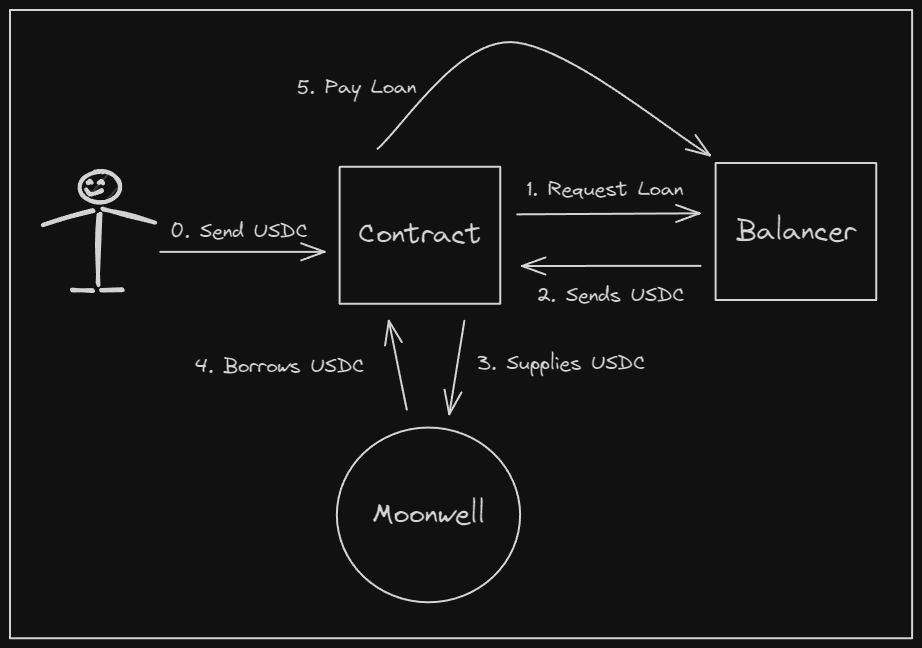
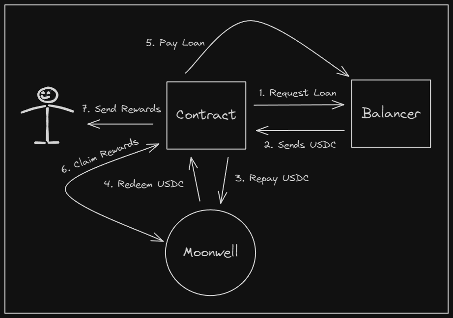

# Leveraged Yield Farm using Flash Loans

Make use of a Flash loan from Balancer to earn more from Moonwell on Ethereum's layer 2 BASE. 

## Technology Stack & Tools

- [Solidity](https://docs.soliditylang.org/en/v0.8.18/) (Writing Smart Contracts)
- Javascript (Testing)
- [Hardhat](https://hardhat.org/) (Development Framework)
- [Ethers.js](https://docs.ethers.org/v6/) (Blockchain Interaction)
- [Alchemy](https://www.alchemy.com/) (Blockchain Connection)
- [Metamask](https://metamask.io/) (Account Management)
- [Moonwell](https://docs.moonwell.fi/moonwell) (Supplying & Borrowing Tokens)
- [Balancer](https://docs.balancer.fi/guides/arbitrageurs/flash-loans.html) (Flash Loan Provider)
- [Base](https://www.base.org/) (Ethereum Layer 2)

## Requirements For Initial Setup
- Install [NodeJS](https://nodejs.org/en/). We recommend using the latest LTS (Long-Term-Support) version, and preferably installing NodeJS via [NVM](https://github.com/nvm-sh/nvm#intro).
- Create an [Alchemy](https://www.alchemy.com/) account, you'll need to create an app for the Base chain.

## Setting Up
### 1. Clone/Download the Repository
Make sure to enter the project directory before attempting to run the project related commands:
`cd flashloan_masterclass_moonwell`

If the directory doesn't exist, you can execute `pwd` to find out your current path, and `ls` to see the files and folders available to you.

### 2. Install Dependencies:
`npm install`

### 3. Create and Setup .env
Before running any scripts, you'll want to create a **.env** file with the following values (see **.env.example**):

- **ALCHEMY_API_KEY=""**

You don't need to, but you can include the following variable in your **.env**:

- **FORK_BLOCK_NUMBER="false"**

Forking the block number may be helpful for speeding up the unit test, working with impersonating accounts, and for other testing scenarios. By default **13546500** is the set block number in the **hardhat.config.js** file. Feel free to experiment and edit it!

### 4. Run Tests:
`npx hardhat test`

### 5. Run Unit Tests w/ Gas Reporting (Optional):
`REPORT_GAS=true npx hardhat test`

## Contract Addresses Used

Here are the main contract addresses used and you can see them in the block explorer. Note that these addresses are only for the BASE network and addresses for contracts can be different for different networks!

- [USDC](https://basescan.org/address/0x833589fCD6eDb6E08f4c7C32D4f71b54bdA02913)
- [Moonwell mUSDC](https://basescan.org/address/0xedc817a28e8b93b03976fbd4a3ddbc9f7d176c22)
- [Moonwell WELL](https://basescan.org/address/0xA88594D404727625A9437C3f886C7643872296AE)
- [Moonwell Comptroller](https://basescan.org/address/0xfbb21d0380bee3312b33c4353c8936a0f13ef26c)
- [Moonwell Reward Distributor](https://basescan.org/address/0xe9005b078701e2A0948D2EaC43010D35870Ad9d2)
- [Balancer Vault](https://basescan.org//address/0xBA12222222228d8Ba445958a75a0704d566BF2C8)

## Overview of Balancer

It helps to reference Balancer's documentation on how their Flash Loans work:

- [Balancer](https://docs.balancer.fi/guides/arbitrageurs/flash-loans.html)

The high level idea is that your smart contract calls on Balancer's Vault contract, specifically their function *flashLoan()*. On their end, they send your smart contract the tokens, and call *receiveFlashLoan()* on your contract.

Your *receiveFlashLoan()* function is basically where you'll use the funds for anything you want. However, once *receiveFlashLoan()* has finished executing, Balancer will check to ensure you've sent their tokens back. If you haven't, Balancer will revert your transaction.

### Balancer's Error Codes

Should you be using Balancer flash loans for your projects, you may come across errors in your testing that relate to Balancer. If you do, the best place to check out is:

- [https://docs.balancer.fi/reference/contracts/error-codes.html#error-codes](https://docs.balancer.fi/reference/contracts/error-codes.html#error-codes)

Some common errors you may see:

- **BAL#515**. This means you haven't paid back the flash loan in your transaction.
- **BAL#528**. This means Balancer doesn't have the amount of tokens you are trying to flash loan.

## Architecture of LeverageYieldFarm

### The Main Entrypoints

There are 2 main entrypoints for interacting with LeveragedYieldFarm:
- *deposit()*
- *withdraw()*

#### Depositing

From a high level, in *deposit()*:
1. You get X amount from the flash loan.
2. You supply the X flash amount + the 30% into Moonwell.
3. You borrow X flash amount from Moonwell.
4. You repay back X amount back to the flash loan.

Below you can see a diagram explaining the transaction. Keep in mind step 0 is a separate transaction and *deposit()* starts on step 1:



#### Withdrawing

Inside of *withdraw()*:
1. You get X amount from flash loan.
2. You repay Moonwell the X amount you borrowed.
3. You redeem X amount you supplied to Moonwell.
4. You repay X amount to the flash loan.
5. Claim any rewards.
6. Send rewards to user.

Below you can see a diagram explaining the transaction:



To get an idea of the overall function flow, in *deposit()*:

1. *deposit()*
2. *getFlashLoan()*
3. *receiveFlashLoan()*
4. *handleDeposit()*

*withdraw()* follow a similar flow:

1. *withdraw()*
2. *getFlashLoan()*
3. *receiveFlashLoan()*
4. *handleWithdraw()*

When looking into the internal handle functions, be sure to reference the documentation for Moonwell. Since Moonwell is a fork of Compound, it helps looking into Compound's documentation as well:

- [https://docs.moonwell.fi/moonwell](https://docs.moonwell.fi/moonwell)
- [https://docs.compound.finance/v2/](https://docs.compound.finance/v2/)

## Advanced Testing and Expanding

### Testing AMOUNT

In the *LeveragedYieldFarm.js* test file, be sure to experiment with changing around values and see the effect it has on the end results. For example you can change the **AMOUNT** around L85:

```javascript
  const AMOUNT = hre.ethers.parseUnits('1', 6)
```

If you do change the AMOUNT be sure to change the amount to transfer to the contract as well:

```javascript
  await (await usdc.connect(deployer).transfer(
    await leveragedYieldFarm.getAddress(),
    hre.ethers.parseUnits('1.1', 6)
  )).wait()
```

### Testing Blocks

You can also look to change the amount of blocks to mine around L105. Remember the idea is that you'll earn WELL every block. Feel free to test different blocks like 10, 100, or even 1,000.

```javascript
  const BLOCKS_TO_MINE = 1
```

Do note that APY rates change overtime based on the market and Moonwell themselves can change how their protocol works so the estimated result at the end may not be entirely accurate.

### Building Scripts

For expanding the project further, and for extra practice, it helps to branch off the unit test and write scripts for interacting with the **LeveragedYieldFarm** contract. Maybe consider building individual scripts for calling *deposit()* and *withdraw()*, and try your hand at determining what other helper scripts you could build.

As an extra more tougher challenge, you could try changing the smart contract to use a different market than USDC, or if you find a different Compound V2 fork out in the wild that provides rewards. 

## Helpful Resources for Flash Loan Research

### Uses of Flash loans
  * Arbitrage - Use the vast funds to make profits from price discrepencies e.g on Exchange.
    - [Example of our Trading Bot Masterclass](https://dappuniversity.teachable.com/courses/940808/lectures/24527435)
  * Leverage - Increase exposure e.g earn more with Yield Farming on protocols like Compound.
  
### Other Flashloan Providers 
  * [DODO](https://docs.dodoex.io/english/contracts/dodo-v1-v2/guides/flash-loan)
    - Example of using a DODO Flash Loan can be found inside of BMU's [video vault](https://dappuniversity.teachable.com/courses/blockchain-mastery-university/lectures/39147770)
  * [Uniswap V2 Flashswaps](https://docs.uniswap.org/protocol/V2/concepts/core-concepts/flash-swaps)
    - Example Uniswap FlashSwap can be [found here](https://github.com/Uniswap/uniswap-v2-periphery/blob/master/contracts/examples/ExampleFlashSwap.sol)
  * [Aave Flashloan](https://docs.aave.com/developers/guides/flash-loans)
  * [Kollateral](https://www.kollateral.co/) - A liquidity aggregator # base
